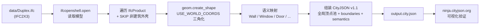

# P5 — IFC → CityJSON 转换器

把 IFC 建筑模型（BIM）转换为 CityJSON 三维城市模型（3D city model），
对应 TU Delft **GEO1004 · 3D-modelling of the Built Environment** 的 IFC/BIM ↔ CityJSON 段。

## 输入输出

| | 路径 | 说明 |
|---|---|---|
| 输入 | `../data/Duplex.ifc` | IFC2X3 标准样例（双拼住宅），295 个 IfcProduct |
| 输出 | `output.city.json` | CityJSON **v1.1**，单栋建筑 MultiSurface + 语义 |
| 脚本 | `coordinate_change.py` | 转换器（本目录） |

## 运行

```bash
cd geo-portfolio/05-ifc2cityjson
D:/Users/Administration/anaconda3/python.exe coordinate_change.py
# → 生成 output.city.json
```

依赖（已装在 anaconda3 / Py3.13.9）：`ifcopenshell 0.8.5`、`cjio 0.10.1`。

## 管线（4 步）



1. **读模型** — `ifcopenshell.open()` 加载 IFC，沿 `#id` 引用自动组装构件（不用手写坐标链）。
2. **几何三角化** — `geom.create_shape(..., USE_WORLD_COORDS=True)` 直接吐**世界坐标**三角面；
   覆盖 `IfcExtrudedAreaSolid` / `SweptSolid` / `Brep` 等所有几何类型（比直接读 `IfcFacetedBrep` 更全）。
3. **语义映射** — 按 IFC 类型 + `PredefinedType` 贴 CityJSON surface type（见下表）。
4. **组装** — 全局顶点池（坐标量化去重）+ `MultiSurface` boundaries + `semantics`，输出合法 CityJSON v1.1。

## 语义映射表

| IFC 类型 | PredefinedType | CityJSON surfaceType |
|---|---|---|
| `IfcWall` / `IfcWallStandardCase` | — | `WallSurface` |
| `IfcSlab` | `BASESLAB` | `GroundSurface` |
| `IfcSlab` | `ROOF` | `RoofSurface` |
| `IfcSlab` | 其他（`FLOOR` 等） | `FloorSurface` |
| `IfcRoof` | — | `RoofSurface` |
| `IfcWindow` | — | `Window` |
| `IfcDoor` | — | `Door` |

## 非建筑外壳清理（SKIP）

Duplex 含大量室内构件，若一并转会污染建筑外壳语义。循环首行用 `SKIP` 集合跳过：

```python
SKIP = {"IfcSpace", "IfcFurnishingElement", "IfcRailing",
        "IfcStairFlight", "IfcOpeningElement", "IfcCovering",
        "IfcMember", "IfcFooting", "IfcBeam"}
```

清理后输出：顶点 2263 / 三角面 5704 / `GenericSurface`=0 / 无 null 索引 / 文件 1.68 MB。
语义分布：Wall 1452 · Window 2656 · Door 1016 · Floor 528 · Roof 52。

## 查看结果

打开 https://ninja.cityjson.org → 拖入 `output.city.json`，确认是一栋双层小楼、
窗/门/墙位置正确、按语义上色。

## 已知限制

- **单栋建筑**：Duplex 样例本身只有 1 栋（`IfcBuilding=1`），所有外壳面并入 1 个 `Building` 的 `MultiSurface`，靠 `semantics` 区分。未拆 `BuildingPart` 按楼层分层（进阶项）。
- **未做 DEM 地形贴合**：Duplex 是局部设计坐标（原点在房子角点），与 Delft `dem.tif`（EPSG:28992 真实地理坐标）不重叠，无法采样贴地。真实地形贴合留给 P4 的 300 栋 `delft_block.json`（同坐标系）。
- **cjio 本地 validate 限制**：`cjio 0.10.1` 的 `validate` 仅认 v2.0 schema，对 v1.1 报版本错——这是工具限制，非文件错误。改用 ninja.cityjson.org 在线验证或结构检查（boundaries/surfaces 对齐、无 null 索引）。

## 对应课程

TU Delft MSc Geomatics — **GEO1004 · 3D-modelling of the Built Environment**：
b-rep、IFC、ISO 19107、CityGML/CityJSON、三维城市模型重建。本 P5 直接命中其 IFC/BIM 段。
