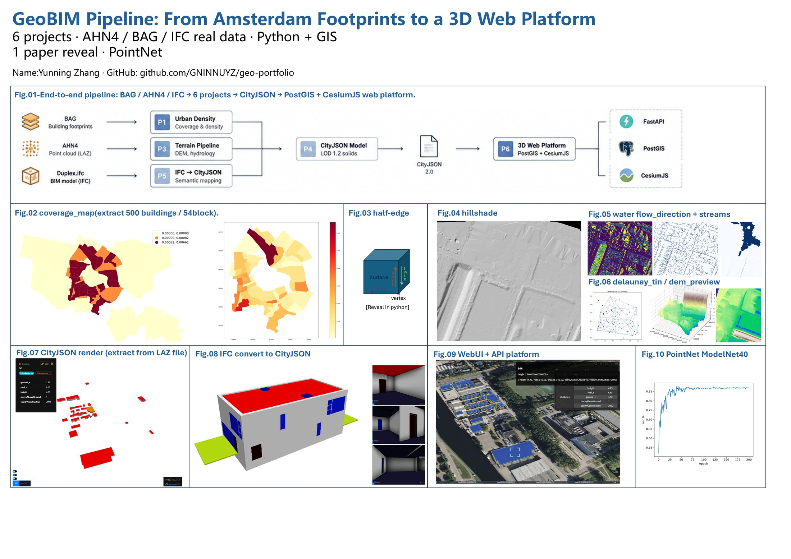

# GeoBIM Portfolio — Yunning Zhang

A portfolio of applied projects in geospatial 3D modelling and point cloud processing, built with real Dutch data (AHN4, BAG, IFC) and Python.

## Overview



*End-to-end pipeline: BAG / AHN4 / IFC → 6 projects → CityJSON → PostGIS + CesiumJS web platform. PointNet is included as a one-off paper reproduction (bottom right).*

**At a glance**

| Stage | Input | Output |
|---|---|---|
| Data acquisition | BAG footprints, AHN4 point cloud (LAZ), Duplex IFC | — |
| Urban Density (01) | BAG footprints, neighbourhood boundaries | Coverage & density per neighbourhood (500 buildings) |
| Terrain Pipeline (03) | AHN4 LAZ, ground points | Delaunay TIN / kriging → DEM, depression filling, D8 flow direction, stream accumulation |
| CityJSON Model (04) | BAG footprints + AHN4 points | LoD 1.2 CityJSON solids, 50 buildings in Delft |
| IFC → CityJSON (05) | Duplex.ifc (BIM) | CityJSON 1.1 with semantic surfaces |
| 3D Web Platform (06) | CityJSON 2.0 | PostGIS + FastAPI + CesiumJS viewer |
| Half-edge Engine (02) | OBJ meshes | Hand-written half-edge structure (see figure above) |
| Point Cloud Toolbox (07) | Dutch airborne LAZ | Voxel filter, kd-tree, RANSAC, ICP (added after this figure was drawn) |
| PointNet (08) | ModelNet40 | Classification, 86% test accuracy (shown bottom right of the figure) |

> The overview figure covers the six pipeline projects plus the PointNet reproduction. Projects **02 (Half-edge Engine)** and **07 (Point Cloud Toolbox)** were finished afterwards and are not drawn in it.

## Projects

| # | Project | Description |
|---|---|---|
| 01 | [Urban Density](01-urban-density/) | Building density analysis of Amsterdam |
| 02 | [Half-edge Engine](02-halfedge-engine/) | Hand-written half-edge data structure |
| 03 | [Terrain Pipeline](03-terrain-pipeline/) | LAZ → TIN → DEM → hydrology |
| 04 | [CityJSON Model](04-cityjson-model/) | Building footprints → LoD 1.2 CityJSON |
| 05 | [IFC → CityJSON](05-ifc2cityjson/) | BIM to CityJSON conversion |
| 06 | [3D Web Platform](06-3d-web-platform/) | FastAPI + PostGIS + CesiumJS viewer |
| 07 | [Point Cloud Toolbox](07-Voxel_filter/) | Voxel filter, KD-tree, RANSAC, ICP |
| 08 | [PointNet](08-pointnet/) | PointNet implemented from the paper, ModelNet40 classification (86%) |

## Tech Stack

Python, GeoPandas, Shapely, Rasterio, laspy, pysheds, pykrige, PyTorch, PostGIS, FastAPI, CesiumJS, IfcOpenShell

## Quick Start

```bash
pip install -r requirements.txt
# see each project folder for run instructions
```

## Data Sources

- AHN4 laser scanning (Dutch national elevation dataset)
- BAG building footprints
- buildingSMART IFC sample (Duplex)
- ModelNet40 (for the PointNet experiment)

## Figures

Full-resolution overview and individual result figures are in [`docs/`](docs/) and in each project folder.
